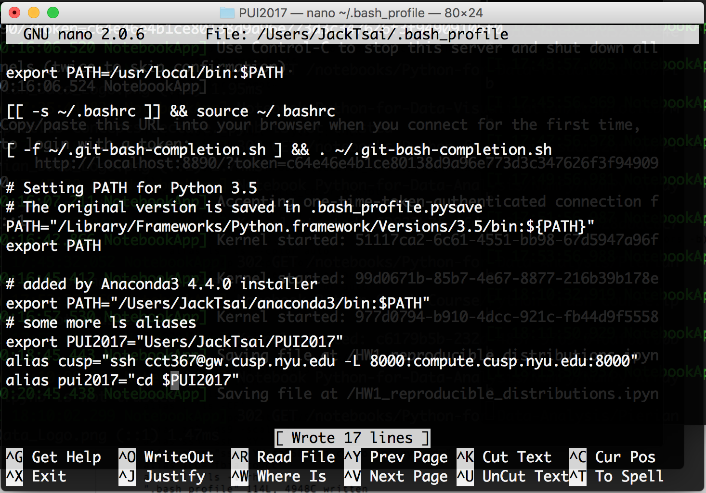
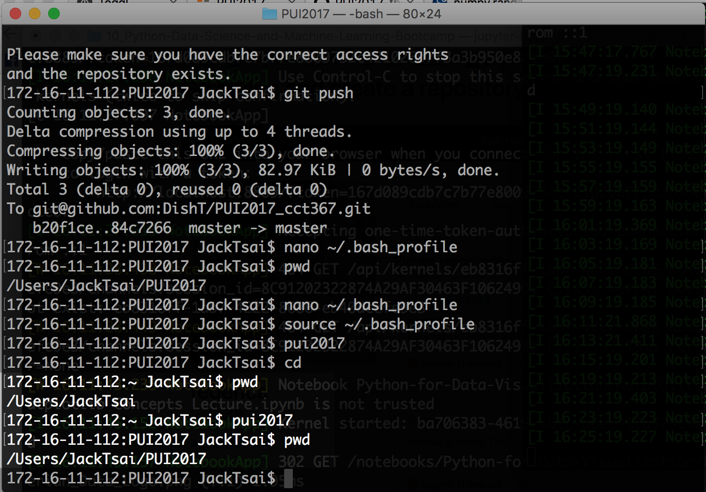

# Set up environment
1. Set up enviromental variable by using export variable "PUI2017"
<pre><code>export PUI2017="/Users/JackTsai/PUI2017"
</code></pre>
2. Set up alias, and put the path in to alias.
<pre><code>alias pui2017="cd $PUI2017"
</code></pre>

3. Check the short cut is working by pwd
