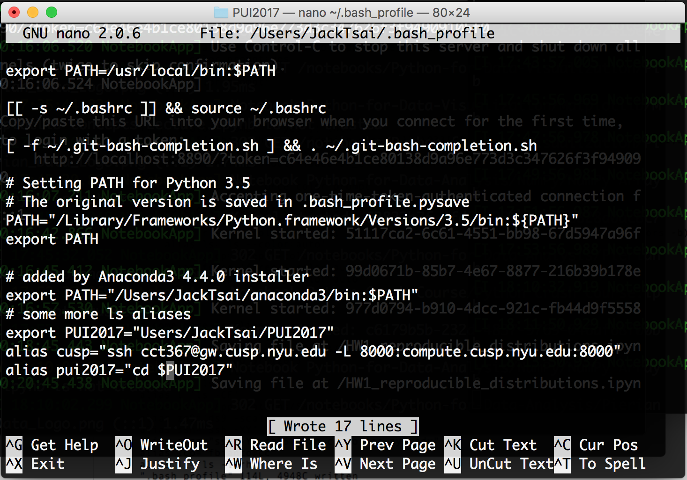

# HW1_2 Set up environment
1. Set up enviromental variable by using export variable "PUI2017"
<pre><code>export PUI2017="/Users/JackTsai/PUI2017"
</code></pre>
2. Set up alias, and put the path in to alias.
<pre><code>alias pui2017="cd $PUI2017"
</code></pre>

3. Check the short cut is working by pwd

# HW1 Outline
1. Set up the repository and pratice the git functions on GitHub
	* Push, Pull, commit, merge conflict
	* Folk people
2. Set up local machine alias
	* nano editor
	* create environment variable
	* set up alias
3. Create a reproducible research
	* Create random seed
	* Plot the data
	* move the x,y mean for 50 arrays

# Coworking
* Merge file with **Yuwen** : [Github]
	
[Github]: https://github.com/ywnch/gittest_ywc249

# Independent
* Set up repository : [HW1_1.PUI2017_cct367]
* Set up the local machine alias : [HW1_2.md]
* Create a reproducible research : [HW1_3.ipynb]

[HW1_3.ipynb]:https://github.com/DishT/PUI2017_cct367/blob/master/HW1_3_cct367.ipynb
[HW1_2.md]: https://github.com/DishT/PUI2017_cct367/blob/master/README_HW1_2.md
[HW1_1.PUI2017_cct367]: https://github.com/DishT/PUI2017_cct367

